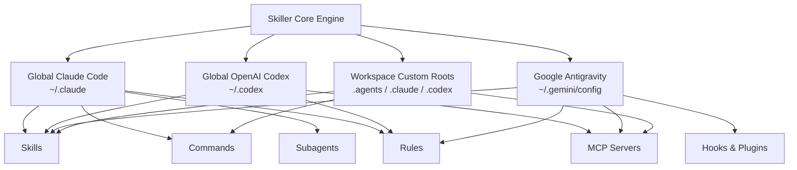

# Skiller ⚡

> **A native, high-performance macOS command center for discovering, managing, inspecting, and triggering AI Agent skills, tools, rules, commands, and MCP servers across Claude Code, OpenAI Codex, and Google Antigravity.**

---

[](https://apple.com)
[](https://swift.org)
[](https://developer.apple.com/xcode/swiftui/)
[](https://anthropic.com)
[](https://openai.com)
[](https://deepmind.google)
[-6B7280?style=flat-square)](#architecture--tech-stack)
[](https://developer.apple.com/documentation/coreservices/file_system_events)
[](LICENSE)

---

## 🏷️ Repository Tags & Topics

```
[skills-manager] [ai-agents] [claude-code] [openai-codex] [antigravity] [gemini-cli]
[mcp-servers] [model-context-protocol] [swiftui] [macos-app] [agentic-workflows]
[developer-tools] [prompt-engineering] [tool-use] [fsevents] [native-macos]
[swift] [menu-bar-app] [productivity] [ai-tools]
```

---

## 📖 Overview

As agentic coding assistants evolve, developers accumulate dozens of custom skills, prompt templates, behavioral rules, subagent personas, and Model Context Protocol (MCP) servers spread across different configuration directories (`~/.claude`, `~/.codex`, `~/.gemini/config`, and project-level `.agents` workspaces).

**Skiller** delivers a unified, native macOS desktop application and menu bar companion to:
1. **Discover & Aggregate**: Automatically scan and index active and disabled components across Claude Code, OpenAI Codex, Antigravity, and workspace roots.
2. **Non-Destructive Enable / Disable**: Toggle tools atomically via disk-level directory pairing (e.g. `skills/` ↔ `skills-disabled/`) without losing configuration data or bloating context windows.
3. **Trigger Heuristics & Scoring**: Compute auto-invocation confidence scores (0%–100%), categorize execution modes (Automatic, Manual, Contextual, Conditional), and preview trigger criteria.
4. **Inspect & Edit with Live Preview**: Full YAML frontmatter parser, structured document overview, live Markdown renderer with syntax-safe code fences, and multi-file asset tree explorer.
5. **Always-Available Menu Bar**: Instant menu bar popup featuring fast fuzzy search, quick component toggling, and copyable prompt templates.
6. **Native Launch at Login**: Frictionless system startup support powered by macOS `SMAppService`.



---

## ✨ Key Features

### 🌐 Unified Multi-Assistant Discovery
Discovers configurations across all major LLM command-line and IDE ecosystems out of the box:
- **Claude Code**: `~/.claude/skills`, `~/.claude/commands`, `~/.claude/agents`, `~/.claude/rules`
- **OpenAI Codex**: `~/.codex/skills`, `~/.codex/mcp_config.json`, `~/.codex/rules`
- **Google Antigravity / Gemini**: `~/.gemini/config/skills`, built-in extensions, `hooks.json`, and `plugins/`
- **Project Workspaces**: Custom folder bookmarks scanning `.agents/`, `.claude/`, and `.codex/` with persistent workspace management.

### 🧩 Complete Component Spectrum
Supports all dimensions of modern agent configurations:
| Kind | Description | Icon | Default Location |
| :--- | :--- | :---: | :--- |
| **Skills** | Reusable toolsets, workflows, and multi-step agent actions with YAML metadata | ⚡ | `skills/` |
| **Agents** | Specialized autonomous subagent personas and sub-task executors | 👤 | `agents/` |
| **Commands** | Slash commands, shell integrations, and one-liner triggers | 💻 | `commands/` |
| **Rules** | System prompt guidelines, styling conventions, and behavioral guardrails | 📜 | `rules/` or `GEMINI.md` |
| **MCP Servers** | Model Context Protocol servers configured via JSON definitions | 🌐 | `mcp_config.json` |
| **Hooks & Plugins**| Lifecycle hooks (`pre_command`, `post_tool`) and bundled extensions | 🧩 | `hooks.json` / `plugins/` |

### ⚡ Non-Destructive Instant Enable / Disable
Easily deactivate unused skills to save LLM context window tokens or prevent conflicting tool calls. Toggling moves directories atomically to/from a `*-disabled` peer directory (e.g. `skills-disabled/`) or toggles configuration flags, preserving all metadata and history without data loss.

### 🧠 Intelligent Trigger Inspector & Likelihood Scoring
- **Automated Trigger Classification**: Analyzes skill descriptions, imperative keywords, and frontmatter to classify skills into `Automatic`, `Manual / Command`, `Contextual`, or `Conditional`.
- **Auto-Likelihood Score**: Dynamic confidence meter (0%–100%) indicating how aggressively an LLM will automatically pull the tool.
- **Trigger Criteria Inspector**: Extracts keyword criteria and conditions matching user prompts.
- **Copyable Invocation Prompts**: Generates optimal, LLM-tuned prompt templates ready to paste into your chat or terminal.

### 📝 Resilient Editor & Live Markdown Preview
- Built-in Markdown reader with robust handling for code blocks and nested formats.
- Live editor for `SKILL.md`, rules, and configurations with undo/redo support.
- File explorer pane to inspect bundled scripts (`scripts/`), templates (`resources/`), and reference documents (`references/`).

### 🪟 Menu Bar Companion App
A lightweight status bar interface accessible anywhere on macOS:
- Quick fuzzy search across all active skills.
- One-click toggling without leaving your code editor or terminal.
- Instant prompt generator copy-to-clipboard.

### 🔄 Live File System Synchronization
Powered by macOS `FSEvents` (`FileWatcherService`) to automatically detect external edits, Git branch switches, and CLI installations in real time without manual reloads.

### 🚀 Launch at Login
Integrated macOS `SMAppService` background launch configuration to keep Skiller active in the background ready to trigger.

---

## 🛠️ Architecture & Tech Stack

Skiller is built from the ground up using modern Swift and native Apple frameworks:

- **Language**: Swift 6.0 (Strict Concurrency & Sendable compliance)
- **UI Framework**: SwiftUI with the `@Observable` macro pattern (macOS 14+ Sonoma & Sequoia)
- **Filesystem Engine**: Custom `FSEvents` file watcher service with async debouncing
- **State Management**: Unidirectional reactive `AppState`
- **Parsing**: Custom resilient YAML frontmatter parser and Markdown tokenizer
- **System Integration**: AppKit `NSApplication` integration, `MenuBarExtra`, and `SMAppService`

### Project Structure

```
Skiller/
├── Package.swift                    # Swift Package Manager manifest (macOS v14+)
├── Scripts/
│   ├── build_app.sh                 # Release build and .app bundle packager
│   ├── generate_icon.py             # App icon generator script
│   └── generate_icon.swift          # Swift icon synthesis utility
├── Sources/
│   └── Skiller/
│       ├── App/
│       │   ├── SkillerApp.swift         # Main app entrypoint & MenuBarExtra
│       │   └── AppState.swift           # Central observable application state
│       ├── Models/
│       │   ├── ComponentKind.swift      # Enum: Skill, Agent, Command, Rule, MCP, Hook
│       │   ├── SkillSource.swift        # Discovery source definitions & paths
│       │   ├── StackItem.swift          # Core unified component model
│       │   ├── Skill.swift              # Skill metadata & file hierarchy model
│       │   ├── FrontmatterParser.swift  # Resilient YAML frontmatter parser
│       │   └── SkillTriggerAnalysis.swift # Trigger heuristics & score calculator
│       ├── Services/
│       │   ├── StackDiscoveryService.swift # Multi-ecosystem folder discovery
│       │   ├── StackManagerService.swift   # Toggle enable/disable & file operations
│       │   └── FileWatcherService.swift    # Low-level FSEvents directory watcher
│       ├── Utilities/
│       │   ├── LaunchAtLoginManager.swift # macOS SMAppService login item manager
│       │   ├── ShellLauncher.swift      # Clipboard & macOS Finder integration
│       │   └── Theme.swift              # Typography, layout tokens & color palette
│       ├── Resources/
│       │   ├── AppIcon.icns             # High-DPI macOS application icon
│       │   ├── AppIcon.png              # Standard PNG application icon
│       │   └── pen.svg                  # Vector source for app icon
│       └── Views/
│           ├── MainView.swift           # Three-column NavigationSplitView layout
│           ├── Sidebar/                 # Sources & Category filtering
│           ├── SkillList/               # Search, sorting, and item cards
│           ├── SkillDetail/             # Inspector, editor, files, and trigger preview
│           ├── MenuBar/                 # MenuBarPopoverView quick-access
│           └── Components/              # Custom reusable Mac controls & badges
└── Tests/
    └── SkillerTests/                # Comprehensive test suites:
        ├── SkillerTests.swift           # Core parsing & trigger heuristics tests
        ├── LibraryPresentationTests.swift # Markdown rendering & presentation tests
        └── LibraryVisualChecks.swift    # View lifecycle visual checks
```

---

## 🚀 Getting Started

### Prerequisites
- **macOS 14.0 (Sonoma)** or **macOS 15.0+ (Sequoia)**
- **Xcode 15.0+** or **Swift 6.0+ Toolchain**
- **GitHub CLI (`gh`)** (optional, for repo management)

### 1. Build and Run Directly with Swift CLI

```bash
# Clone the repository
git clone https://github.com/Rasalp1/Skiller.git
cd Skiller

# Run in development mode
swift run Skiller
```

### 2. Build Standalone Release `.app` Bundle

Skiller includes an automated build script to package a standalone native `.app` bundle:

```bash
# Make the build script executable and run
chmod +x Scripts/build_app.sh
./Scripts/build_app.sh

# Open the compiled application
open dist/Skiller.app
```

You can drag `dist/Skiller.app` directly into your `/Applications` directory.

---

## ⌨️ Keyboard Shortcuts & Usage

| Shortcut / Action | Function |
| :--- | :--- |
| `⌘ + R` | Refresh and re-scan all skill sources |
| `⌘ + F` | Focus the global search field |
| `Space` | Toggle enable / disable status of selected item |
| `⌘ + C` (on Trigger View) | Copy generated trigger prompt to clipboard |
| `⌘ + Click` (on File Path) | Reveal skill directory in macOS Finder |
| `Esc` | Clear active search query |

---

## 🤝 Supported Directory Schemas

Skiller automatically recognizes and structures files following standard AI agent skill conventions:

```
~/.claude/skills/my-awesome-skill/
├── SKILL.md                 # Required: Main instructions & YAML frontmatter
├── scripts/                 # Optional: Executable helpers (Python, Bash, JS)
│   └── run.py
├── references/              # Optional: Documentation & knowledge files
│   └── cheatsheet.md
└── resources/               # Optional: Assets and templates
```

```
~/.gemini/config/
├── skills/                  # Active Antigravity skills
├── rules/                   # Active rules & prompt instructions
├── mcp_config.json          # MCP server definitions
└── hooks.json               # Agent lifecycle hooks
```

```
~/.codex/
├── skills/                  # Active OpenAI Codex skills
├── rules/                   # Active instructions & conventions
└── mcp_config.json          # MCP server definitions
```

---

## 🧪 Testing

Run the automated test suite covering YAML parsing, trigger classification, presentation rendering, and layout rules:

```bash
swift test
```

All 8 tests across 4 suites run in parallel and pass with 100% strict concurrency safety.

---

## 🔒 Security & Privacy

- **100% Local**: All inspection, parsing, and management happens strictly on-device. No telemetry, no external network requests, and no third-party cloud connections.
- **Non-Destructive Operations**: Enable/disable actions use atomic filesystem folder renames without modifying the internal file contents.

---

## 📄 License

This project is licensed under the MIT License - see the [LICENSE](LICENSE) file for details.

---

<div align="center">
  <sub>Crafted for agentic engineers building the future of software development with Claude Code, OpenAI Codex, and Google Antigravity.</sub>
</div>
